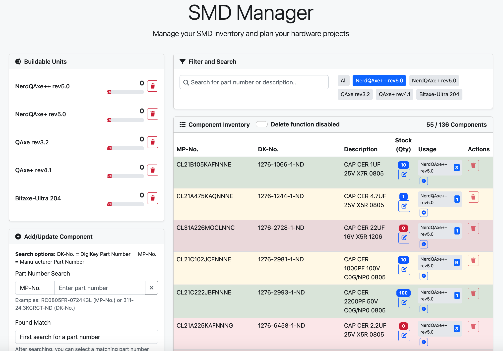

# SMD-Manager

An application for managing SMD components, BOM imports, and device assignments.

## Features

- Management of SMD component inventory
- BOM import in CSV format
- DigiKey API integration for product information
- Device assignment for components
- Analysis of missing parts for device production
- Responsive user interface



## Requirements

- Python 3.8 or higher
- Flask
- SQLAlchemy
- Redis (optional for improved caching)
- python-dotenv

## Installation

### Option 1: Local Installation

1. Clone repository:
```bash
git clone https://github.com/AnimaI/SMD-Manager.git
cd SMD-Manager
```

2. Create and activate virtual environment:
```bash
python3 -m venv venv
source venv/bin/activate  
# On Windows: venv\Scripts\activate
```

3. Install dependencies:
```bash
pip install -r requirements.txt
```

4. Configure `.env` file:
```
cp .env.example .env
# Edit .env with your settings
```

5. Start application:
```bash
python3 app.py
```

### Option 2: Docker Compose

1. Clone repository:
```bash
git clone https://github.com/AnimaI/SMD-Manager.git
cd SMD-Manager
```

2. Configure .env file:
```
cp .env.example .env
# Edit .env with your settings
```

3. Start Docker Compose:
```bash
docker-compose up -d
```

### Option 3: Setting up as a systemd service

1. Install the application following Option 1 steps 1-4 in your desired location.

2. Create a systemd service file:
```bash
sudo nano /etc/systemd/system/smd-manager.service
```

3. Add the following configuration (adjust all paths and user/group settings to match your environment):
```
[Unit]
Description=SMD Manager Service
After=network.target redis-server.service
Requires=redis-server.service

[Service]
# Replace with actual user/group that should run the service
# For a system-wide installation, consider using a dedicated user
User=REPLACE_WITH_ACTUAL_USER
Group=REPLACE_WITH_ACTUAL_GROUP

# Replace with the actual path to your SMD-Manager installation
WorkingDirectory=REPLACE_WITH_PATH_TO_SMD_MANAGER
Environment="PATH=REPLACE_WITH_PATH_TO_SMD_MANAGER/venv/bin"

# Redis configuration (if using Redis)
Environment="REDIS_HOST=localhost"
Environment="REDIS_PORT=6379"
Environment="REDIS_DB=0"

# Path to your .env file with settings
EnvironmentFile=REPLACE_WITH_PATH_TO_SMD_MANAGER/.env

# Path to the Python interpreter in your virtual environment
ExecStart=REPLACE_WITH_PATH_TO_SMD_MANAGER/venv/bin/python3 app.py
Restart=always
RestartSec=10

[Install]
WantedBy=multi-user.target
```

4. Reload systemd, enable and start the service:
```bash
sudo systemctl daemon-reload
sudo systemctl enable smd-manager
sudo systemctl start smd-manager
```

5. Check service status:
```bash
sudo systemctl status smd-manager
```

6. View logs:
```bash
sudo journalctl -u smd-manager -f
```

### Redis Cache Configuration (Optional)

While the application works without Redis (using in-memory caching), Redis provides better caching performance for DigiKey API calls.

#### Installing and Configuring Redis

**Ubuntu/Debian:**
```bash
# Install Redis
sudo apt update
sudo apt install redis-server

# Edit the configuration to enable as a service
sudo nano /etc/redis/redis.conf
# Change 'supervised no' to 'supervised systemd'

# Restart and enable Redis
sudo systemctl restart redis-server
sudo systemctl enable redis-server
```

**CentOS/RHEL/Fedora:**
```bash
# Install Redis
sudo yum install redis

# Start and enable Redis
sudo systemctl start redis
sudo systemctl enable redis
```

**Verify Redis is running:**
```bash
redis-cli ping
# Should respond with PONG
```

#### Configure Application to Use Redis

1. Update your `.env` file with Redis settings:
```
REDIS_HOST=localhost
REDIS_PORT=6379
REDIS_DB=0
```

2. If using the systemd service method, ensure these values are included in the service file as shown in the example above.

3. Reload systemd and restart the service:
```bash
sudo systemctl daemon-reload
sudo systemctl restart smd-manager
```

#### Checking Redis Status

You can check if the application is using Redis by looking at the logs:
```bash
sudo journalctl -u smd-manager | grep "Redis cache"
```

If functioning correctly, you should see: "Redis cache enabled"

## BOM Format

The application supports CSV files with the following format:

```
Device,Device Name v1.0
DigiKey-No,Quantity
311-24.3KCRCT-ND,5
CKN10502-ND,10
...
```

## DigiKey API Connection

The application uses the DigiKey API for product information. To use this:

1. Register for DigiKey API access: https://developer.digikey.com/
2. Obtain Client ID and Client Secret
3. Add the credentials to the `.env` file

## Security Notes

- The application should be operated behind a reverse proxy like Nginx
- In production, `FLASK_DEBUG=False` should be set
- API keys should be set as environment variables

## Support

If you like this project and want to support future work, I would appreciate a donation:

<a href='https://ko-fi.com/B0B21BSWAP' target='_blank'></a>

<a href="https://www.buymeacoffee.com/_animai" target="_blank"></a>

<p> bc1qkz29mjsyn5k4hwezf7gxg4gnleh85k0wnm8htd</p>

<p> <a href="https://getalby.com/p/animai">animai@getalby.com</a> (Bitcoin Lightning)</p>

## License

This project is licensed under the GNU General Public License v3.0 - see the LICENSE file for details. This means you can freely use, modify and distribute this software, but if you distribute derivative works, you must make them available under the same license (GPL-3.0) and provide the source code.
